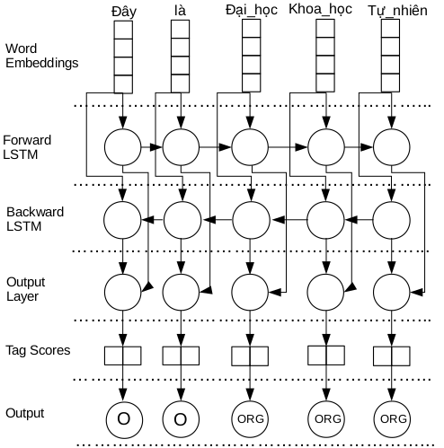

# Rich-Features-NER-BiLSTM-CRF
Build a Neural Network Model based on Rich Features for Named Entity Recognition

### Architecture of our proposed approach

 
(Meaning: Here is the University of Science)

### Datasets Files format
Word Lemma Brown_Cluster POS CHUNK NE_label

### Baseline
python factored_bi_lstm.py -d eng.train.added -t eng.testa.added

### Train a new Model with all features
python factored_bi_lstm_5fea.py -d eng.train.added -t eng.testa.added

### Cite our Papers
Ngoc Tan Le et al. Data Adaptation for Named Entity Recognition in Twitter with Features-Rich CRF. In Proceedings of NAACL HLT 2018, Widening Natural Language Processing workshop, New Orleans, Louisiana, USA, 1 to 6 June 2018.

Ngoc Tan Le et al. Neural Network-based Model for Named Entity Recognition in Low-Resource Settings. In Proceedings of NAACL HLT 2018, Widening Natural Language Processing workshop, New Orleans, Louisiana, USA, 1 to 6 June 2018.

Ngoc Tan Le, Long Nguyen, Damien Nouvel, Fatiha Sadat, Dien Dinh. Named Entity Recognition for tweets : a case study French. In Proceedings of 19ème Conférence sur l’apprentissage automatique, Grenoble, France, 28-30 Juin 2017.

